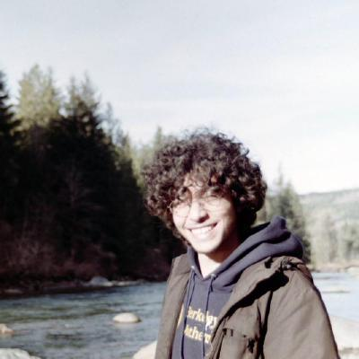

{::options parse_block_html="true" /}

 

  {:width="120px"}
 

 

  - PhD Candidate
  - 557 [Vincent Hall](https://campusmaps.umn.edu/vincent-hall)  
    [206 Church St SE](https://goo.gl/maps/CisvELEGxtSXptyp7)  
    Minneapolis, MN 55455
  - mahrud [at] math.umn.edu
  - Pronouns: He/Him
  {: style="font-size: smaller"}
 

### About me
I am a four$+\epsilon$-th-year Ph.D. student working with [Christine Berkesch]. \\
My résumé is [here](mahrud.pdf), and here are some recent updates:

- *Fall 2022*: AMS sectional meetings in El Paso, Texas and Salt Lake City, Utah.
- *Aug. 2022*: [MAGGC](https://sites.google.com/uic.edu/maggc-2022/home) in Chicago, Illinois.
- *July 2022*: [Minischool](https://sites.google.com/view/derivedfrg/events/michigan-2022) in Ann Arbor, Michigan.
- *June 2022*: [PASCA](https://jack-jeffries.github.io/PASCA.html) in Guanajuato, Mexico.
- *Oct. 2021*: [_Characterizing Multigraded Regularity on Products of Projective Spaces_](https://arxiv.org/abs/2110.10705).
{: style="font-size: 0.85em"}

### Research
My interests lie in the neighborhood of algebraic geometry, commutative algebra, and intersection theory.
Roughly speaking, I'm interested in using derived tools to translate the book _Geometry of Syzygies_ to the toric setting. Here are some things I've recently read about:

- Castelnuovo--Mumford Regularity and Truncations of modules on Toric Varieties
- Beilinson monads and the (toric) Bernstein--Gelfand--Gelfand correspondence
- Fourier--Mukai Transforms and Exceptional Collections
- Horrocks Splitting Criterion and Tate Resolutions
- Derived Category of Simplicial Toric Varieties
- Toric Vector Bundles and Virtual Resolutions
- Mori Dream Spaces and GKM Varieties
- Losev--Manin Moduli Spaces
{: style="font-size: 95%"}


- Toric Minimal Model Program
- Hilbert Schemes and Generic Ideals
- Linkage and Residual Intersections
- $D$-Modules and Hodge Ideals


I passed my oral exam on June 16th, 2021. Here are my [exam materials](oral).

*[algebraic geometry]: of the concrete kind!
*[intersection theory]: of the computational kind!
*[commutative algebra]: of the combinatorial kind!

## Activities

If you'd like to join or contribute to any of these activities, feel free to get in touch.

### [GradMoCCA ☕](GradMoCCA)
With Caitlyn and Connor, we organized a graduate student conference here in Minneapolis.

### [Directed Reading Program](drp)
The Directed Reading Program is a graduate student-run program that provides undergraduates with the
opportunity to work closely with mathematics graduate students in an independent reading project.

### [Student Commutative Algebra Meeting](seminars/SCAM)
- Spring      2022: Research Meetings
- Fall &nbsp; 2021: Research Meetings
- Spring      2021: Student talks and pre-talks for the adult seminar
- Fall &nbsp; 2020: On hiatus
- Spring      2020: Introductory topics and $D$-Modules
- Fall &nbsp; 2019: [Boij-Söderberg theory](https://arxiv.org/abs/1106.0381)
{: style="font-family: monospace"}

### [Combinatorial Algebraic Geometry @ ICERM](https://icerm.brown.edu/programs/sp-s21/)
I participated in the Spring 2021 program at ICERM.


### [AMS Grad Blog](https://blogs.ams.org/mathgradblog/author/msayrafi/)
I'm a staff writer for the [AMS Grad Blog], which is a blog for and by math graduate students.


### [Macaulay2](journal)
A main aspect of my research involves developing and implementing algorithms to study explicit examples
in algebraic geometry and commutative algebra. Here are some of the packages I've [contributed] to:

- [FGLM](http://www2.macaulay2.com/Macaulay2/doc/Macaulay2/share/doc/Macaulay2/FGLM/html/)
- [LocalRings](http://www2.macaulay2.com/Macaulay2/doc/Macaulay2/share/doc/Macaulay2/LocalRings/html/)
- [Saturation](http://www2.macaulay2.com/Macaulay2/doc/Macaulay2/share/doc/Macaulay2/Saturation/html/)
- [Truncations](http://www2.macaulay2.com/Macaulay2/doc/Macaulay2/share/doc/Macaulay2/Truncations/html/)
- [VirtualResolutions](http://www2.macaulay2.com/Macaulay2/doc/Macaulay2/share/doc/Macaulay2/VirtualResolutions/html/)
- [NormalToricVarieties](http://www2.macaulay2.com/Macaulay2/doc/Macaulay2/share/doc/Macaulay2/NormalToricVarietiesVirtualResolutions/html/)
{: style="font-family: monospace"}

Always happy to chat about Macaulay2 and learn how others use it in research.

## Personal

I'm a fan of fermented foods, volcanoes, sewing, anti-racism, poetry, and bouldering.
In other lives I would have studied [gerrymandering], quantum information, cryptography, and [radio astronomy].

[Christine Berkesch]: http://www-users.math.umn.edu/~cberkesc/
[School of Mathematics]: https://math.umn.edu/
[AMS Grad Blog]: https://blogs.ams.org/mathgradblog/
[ICERM]: https://icerm.brown.edu/
[Combinatorial Algebraic Geometry]: https://icerm.brown.edu/programs/sp-s21/
[gerrymandering]: https://www.quantamagazine.org/the-mathematics-behind-gerrymandering-20170404/
[radio astronomy]: static/astro121_North Polar Spur.gif
[contributed]: https://github.com/Macaulay2/M2/commits?author=mahrud
