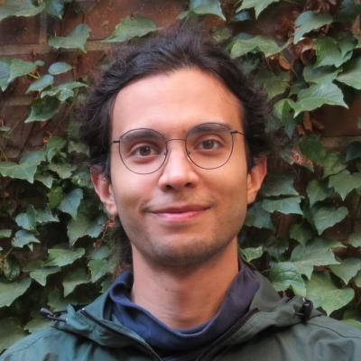

{::options parse_block_html="true" /}

 

  {:width="120px"}
 

 

  - Postdoc Researcher
  - [McMaster University](https://math.mcmaster.ca/)  
    [1280 Main Street West](https://maps.app.goo.gl/GMMc7qHHo75FsNXC6)  
	Hamilton, Ontario L8S 4L8
  - mahrud [at] mcmaster.ca
  - Pronouns: He/Him
  {: style="font-size: small"}
 

### About me
I am a Britton postdoctoral fellow at [McMaster University](https://math.mcmaster.ca/) in Canada.

Previously, I was a postdoc at the [Nonlinear Algebra](https://www.mis.mpg.de/nonlinear-algebra) group at MPI MiS in Leipzig, Germany.   I obtained my PhD from University of Minnesota in May 2024, advised by [Christine Berkesch].

[Fields Institute](http://www.fields.utoronto.ca/activities/24-25/commutative) in Toronto
Before that I was an undergraduate at UC Berkeley.


I am on the **job market**.
My CV is [here](mahrud.pdf), and here are some recent updates and upcoming plans:

- *Apr. 2026*: [Regularity in Algebra, Combinatorics, and Geometry](https://www.birs.ca/events/2026/5-day-workshops/26w5583) at BIRS.
- *Jan. 2026*: [Joint Math Meetings](https://jointmathematicsmeetings.org/meetings/national/jmm2026/jmm2026-agenda) in Washington, D.C.
- *New*{: style="color: red"}: [_Computing Global Ext for Complexes_](https://arxiv.org/abs/2509.25103).
- *Sep. 2025*: [Route 81 Mathematics Conference](https://mast.queensu.ca/~ggsmith/2025Route81/) at Queen's University.
- *Sep. 2025*: [Singularities, D-modules, and Connections to Physics](https://www.birs.ca/events/2025/5-day-workshops/25w5338) at BIRS.
- *New*{: style="color: red"}: [_Computing Direct Sum Decompositions_](https://arxiv.org/abs/2412.19799) _published in_{: style="font-size: small"} [Journal of Symbolic Computation](https://doi.org/10.1016/j.jsc.2025.102486)!
- *Aug. 2025*: [Mirror symmetry and syzygies](https://aimath.org/workshops/upcoming/hmsandmga/) at AIM.
- *New*{: style="color: red"}: [_Connection Matrices in Macaulay2_](https://arxiv.org/abs/2504.01362).
- *New*{: style="color: red"}: [_Splitting of vector bundles on toric varieties_](https://arxiv.org/abs/2412.19793).
- *Updated*{: style="color: red"}: [_Bounds on Multigraded Regularity_](https://arxiv.org/abs/2208.11115).
- *Updated*{: style="color: red"}: [_Characterizing Multigraded Regularity and Virtual Resolutions on $\mathbb P^n\times\dots\\times\mathbb P^m$_](https://arxiv.org/abs/2110.10705).


- *Apr. 2026*: [Regularity in Algebra, Combinatorics, and Geometry](https://www.birs.ca/events/2026/5-day-workshops/26w5583) at BIRS.
- *Published*{: style="color: red"}: [_A short resolution of the diagonal for bigraded smooth projective toric varieties_](https://arxiv.org/abs/2208.00562).
_(Published in [Algebra & Number Theory](https://msp.org/ant/about/journal/about.html)!)_{: style="font-size: small; float: right"}


### [Research](research)
My research area is multigraded commutative algebra, particularly in the setting of toric geometry. Roughly speaking, I'm interested in using derived categories to translate the book [_Geometry of Syzygies_] to the toric setting and beyond.

Things I've recently thought about:

- Green's $N_p$ conditions for subvarieties of toric varieties
- Projectivized toric vector bundles and complexity one $T$-varieties
- GIT fan and truncations of modules over Cox rings
- $F$-thickness of del Pezzo surfaces and other Mori dream spaces
- Fourier--Mukai transforms and exceptional collections in derived categories
- Beilinson monads and homological mirror symmetry
- Horrocks splitting criterion and virtual resolutions
- $K$-equivalence and $D$-equivalence
{: style="font-size: 95%"}


- Tate resolutions and the (toric) BGG correspondence
- Weak factorization of toric varieties and positivity
- Mori Dream Spaces and GKM Varieties
- Losev--Manin Moduli Spaces
- Toric Minimal Model Program
- Hilbert Schemes and Generic Ideals
- Linkage and Residual Intersections
- $D$-Modules and Hodge Ideals

*[algebraic geometry]: of the concrete kind!
*[intersection theory]: of the computational kind!
*[commutative algebra]: of the combinatorial kind!


## Activities

If you'd like to join or contribute to any of these activities, feel free to get in touch.


### [Apr. 2024: AMS Sectional in Milwaukee‍](https://www.ams.org/meetings/sectional/2318_program.html)
With [Maya] and [Ola], we're planning a session on nonstandard & multigraded commutative algebra.


### [Dec. 2025: CA-AG at the CMS Winter Meeting](https://winter25.cms.math.ca)
With [Adam] and [Giulia], we are planning a commutative algebra special session in Toronto. \\
A parallel session planned by [Megumi], [Brett], and [Sasha] focuses on algebraic geometry instead.

[Megumi]: https://ms.mcmaster.ca/~haradam/
[Brett]: https://sites.google.com/view/brett-nasserden/home
[Sasha]: https://sites.google.com/view/szotine/home

### [July 2025: M2 🤝 SIAM AAG](https://tjyahl.github.io/organizing/M2-Madison-2025/)
With [Thomas B.] and [Thomas Y.], we organized a Macaulay2 workshop in Madison.

### [Nov. 2024: M2 in the Sciences 🧑‍🔬](https://macaulay2.github.io/Workshop-2023-Minneapolis/)
With [Ben], we organized a Macaulay2 workshop in Leipzig, Germany.

### [June 2023: M2Week 🧑‍💻](https://macaulay2.github.io/Workshop-2023-Minneapolis/)
With [Ayah], [Christine], [Tim], and [Mike], we organized a Macaulay2 workshop and mini-school.

### [May 2022: GradMoCCA ☕](GradMoCCA)
With [Christine], [Caitlyn], and [Connor], we held a graduate student conference in Minneapolis.

### Macaulay2 Research Group

Together with several other postdocs and early-career researchers, we started a focused research group called the [M2 Potluck Collective](M2-fu), where we work on computational obstructions in our research.

More generally, developing and implementing algorithms to study explicit examples in algebraic geometry and commutative algebra is an aspect of my research. Some packages I've [contributed] to:

> Commutative Algebra
([DirectSummands](https://mahrud.github.io/LearnM2/packages/#DirectSummands),
[Isomorphism](https://mahrud.github.io/LearnM2/packages/#Isomorphism),
[Truncations](https://mahrud.github.io/LearnM2/packages/#Truncations),
[FGLM](https://mahrud.github.io/LearnM2/packages/#FGLM),
[LocalRings](https://mahrud.github.io/LearnM2/packages/#LocalRings)), \\
Algebraic Geometry
([Varieties](https://mahrud.github.io/LearnM2/packages/#Varieties),
[VirtualResolutions](https://mahrud.github.io/LearnM2/packages/#VirtualResolutions),
[NormalToricVarieties](https://mahrud.github.io/LearnM2/packages/#NormalToricVarieties)), \\
Algebraic Analysis
([HolonomicSystems](https://mahrud.github.io/LearnM2/packages/#HolonomicSystems),
[ConnectionMatrices](https://mahrud.github.io/LearnM2/packages/#ConnectionMatrices)), \\
and various improvements in the core, engine, and interpreter of Macaulay2.
{: style="font-family: monospace; font-size: 90%"}

### [Directed Reading Program](drp)
The Directed Reading Program is a graduate student-run program that matches undergraduates with mathematics graduate students in independent reading projects followed by presentations.

You can read about the DRP in the School of Mathematics _[Critical Points newsletter!](https://cse.umn.edu/math/news/directed-reading-program-fosters-connection-and-community-mathematics-students)_

## Old News
Travel, talks, papers, et cetera:



- *Apr. 2025*: [Toric Geometry Workshop](https://www.mfo.de/occasion/2515/www_view) at Oberwolfach.
- *Spring 2025*: [Fields semester in Commutative Algebra and Applications](http://www.fields.utoronto.ca/activities/24-25/commutative) in Toronto.
- *Oct. 2024*: [Group actions, combinatorial methods, and Fano varieties](https://www.uibk.ac.at/mathematik/personal/braun/conference.html) in Innsbruck.
- *Sep. 2024*: [Syzygies and Hilbert Schemes](https://syzygies.mimuw.edu.pl/) in Kraków, Poland.
- *Sep. 2024*: [School on Deformation Theory IV](https://www.donatellaiacono.it/sdt/sdt.html) in Rome, Italy.
- *Jul. 2024*: [Effective Methods in Algebraic Geometry](https://www.mis.mpg.de/events/series/mega-2024) in Leipzig, Germany.
- *May 2024*{: style="color: red"}: I defended my dissertation on May 7th. Here are my [exam materials](defense).
- *May  2024*: [AMS sectional meeting](https://www.ams.org/meetings/sectional/2299_progfull.html) in San Francisco.
- *Spring 2024*: [SLMath semester in Commutative Algebra](https://www.slmath.org/workshops/1053) (~2 weeks/month).
- *Jan. 2024*: [Joint Math Meetings](https://www.jointmathematicsmeetings.org/meetings/national/jmm2023/2300_presenters.html#SAYRAFI,%20MAHRUD) in San Francisco, CA.
- *Dec. 2023*: [Iberoamerican Congress on Geometry](https://geometryrc.ufro.cl/icg2023/) at Pucón, Chile 🌋.
- *Nov. 2023*: [WAGS](https://sites.google.com/a/wagsymposium.org/current/wustl-fall-2023) at Washington University in St. Louis.
- *Oct. 2023*{: style="color: red"}: [_A short resolution of the diagonal for bigraded smooth projective toric varieties_](https://arxiv.org/abs/2208.00562) is [accepted](https://msp.org/ant/2024/18-10/p05.xhtml){: style="color: red"}!
- *Oct. 2023*: [AMS sectional meeting](https://www.ams.org/meetings/sectional/2307_progfull.html#2307:SS9A) in Omaha, Nebraska.
- *Sep. 2023*: [Syzygies and mirror symmetry](https://aimath.org/workshops/upcoming/syzygyms/) at AIM.
- *Sep. 2023*: [Macaulay2 workshop](https://aimath.org/workshops/upcoming/macaulay2efie/) at AIM.
- *2023--24*: [Doctoral Dissertation Fellowship](https://cse.umn.edu/math/news/anh-trong-nam-hoang-and-mahrud-sayrafi-awarded-doctoral-dissertation-fellowships) from University of Minnesota
- *July 2023*: [SIAM AAG23](https://sites.google.com/view/gaelxxx/home) in Eindhoven, NL.
- *July 2023*: [GAeL XXX](https://sites.google.com/view/gaelxxx/home) in Warwick, UK.
- *June 2023*: [Derived Categories MRC](https://www.ams.org/programs/research-communities/2023MRC-DerivedCategories).
- *May  2023*: TA at [MSRI/CMND summer school](https://sites.nd.edu/msri-cmnd-2023workshop/).
- *Apr. 2023*: [CA+ Conference](https://math.umn.edu/~cberkesc/CA/CA2023.html) in Minneapolis, Minnesota.
- *Apr. 2023*: [Syzygies and Regularity](https://wlzhang.people.uic.edu/SyzygiesRegularity/) graduate workshop in Chicago, Illinois.
- *Mar. 2023*: AMS sectional meeting in Atlanta, Georgia.
- *Dec. 2022*: [Graduate Workshop on Birational Geometry](https://scgp.stonybrook.edu/archives/37720) at SCGP, New York.
- *Fall 2022*: AMS sectional meetings in El Paso, Texas and Salt Lake City, Utah.
- *Fall 2022*: [WAGS](https://sites.google.com/a/wagsymposium.org/current/ucr-fall-2022) at UC Riverside.
- *Aug. 2022*{: style="color: red"}: [_Bounds on Multigraded Regularity_](https://arxiv.org/abs/2208.11115).
- *July 2022*: [Derived Minischool](https://sites.google.com/view/derivedfrg/events/michigan-2022) in Ann Arbor, Michigan.
- *June 2022*: [PASCA](https://jack-jeffries.github.io/PASCA22/PASCA.html) summer school in Guanajuato, Mexico.
- *Oct. 2021*{: style="color: red"}: [_Characterizing Multigraded Regularity on Products of Projective Spaces_](https://arxiv.org/abs/2110.10705).
- *June 2021*: I passed my oral exam on June 16th. Here are my [exam materials](oral).
- *Spring 2021*: ICERM's [Combinatorial Algebraic Geometry] program (virtual).
- *Nov. 2020*: Blog post on the [AMS Capital Currents Blog](https://blogs.ams.org/capitalcurrents/2020/11/04/in-order-to-prevent-an-exodus-of-international-phd-students-we-must-stand-together/).
- *Dec. 2019*: Blog post on the [AMS Grad Blog](https://blogs.ams.org/mathgradblog/2019/12/27/mathematics-from-arts/).
{: style="font-size: 90%"}

Here are some activities I've been involved with in the past:

### [Student Commutative Algebra Meeting](seminars/SCAM)
- Spring      2023: (informal) Research Meetings
- Fall &nbsp; 2022: (informal) Research Meetings
- Spring      2022: Research Meetings
- Fall &nbsp; 2021: Research Meetings
- Spring      2021: Student talks and pre-talks for the adult seminar
- Fall &nbsp; 2020: On hiatus
- Spring      2020: Introductory topics and $D$-Modules
- Fall &nbsp; 2019: [Boij-Söderberg theory](https://arxiv.org/abs/1106.0381)
{: style="font-family: monospace"}

## Personal

I'm a fan of fermented foods, volcanoes, sewing & mending, anti-racism, biking, and backpacking. \\
I also like [radio astronomy], anti-gerrymandering, cryptography, and privacy as a human right.

[Adam]: https://ms.mcmaster.ca/~vantuyl/
[Giulia]: https://www.giuliagaggero.com/
[Maya]: https://sites.google.com/wisc.edu/mayabanks
[Ola]: https://people.math.wisc.edu/~asobieska/
[Ayah]: https://sites.google.com/view/ayah-almousa
[Tim]: https://timduff35.github.io/timduff35/
[Mike]: https://sites.google.com/view/michaelperlman/home
[Caitlyn]: https://sites.google.com/wisc.edu/cbooms
[Connor]: https://people.math.wisc.edu/~csimpson6/
[Ben]: https://sites.google.com/view/benhollering
[Thomas B.]: https://tbrazel.github.io/
[Thomas Y.]: https://tjyahl.github.io/
[Christine]: https://math.umn.edu/~cberkesc/
[Christine Berkesch]: https://math.umn.edu/~cberkesc/

[contributed]: https://github.com/Macaulay2/M2/commits?author=mahrud
[radio astronomy]: {{ site.baseurl }}/static/astro121_North Polar Spur.gif
[_Geometry of Syzygies_]: https://math.umn.edu/~reiner/REU/REU2019notes/2005_Book_TheGeometryOfSyzygies.pdf
[Doctoral Dissertation Fellowship]: https://cse.umn.edu/math/news/anh-trong-nam-hoang-and-mahrud-sayrafi-awarded-doctoral-dissertation-fellowships
[Combinatorial Algebraic Geometry]: https://icerm.brown.edu/programs/sp-s21/
